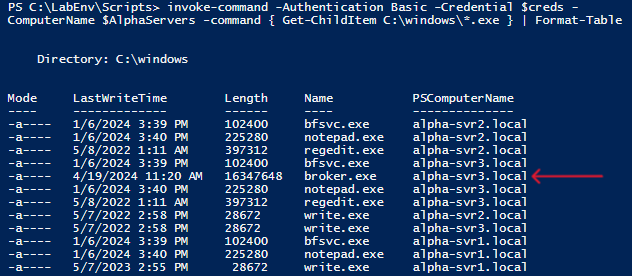
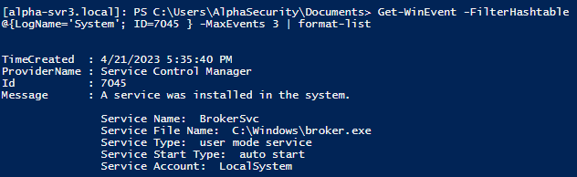
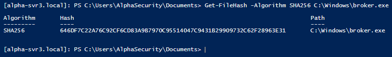
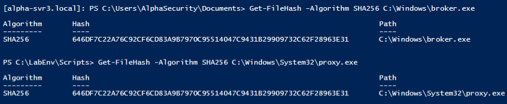
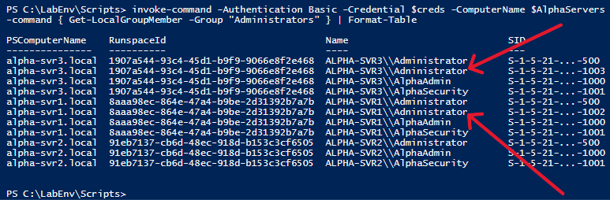

# 🛍️ Project Walkthrough

## *Threat Hunting at Scale with PowerShell Remoting*


## 🔹 **Step 1: Launch Remote Servers**

Run the pre-configured lab setup script to simulate three remote Windows Server containers.

```powershell
.\start-servers.ps1
```

>💡 *This script starts alpha-svr1, alpha-svr2, and alpha-svr3.*

---

## 🔹 **Step 2: Load Server List**

The lab provided a pre-configured file containing the names of the target systems. This list was stored in a specified directory within the lab environment.

```powershell
[string[]]$AlphaServers = Get-Content -Path 'C:\LabResources\server-list.txt'
```

 `$AlphaServers`: Loads hostnames of the remote systems into an array

>🗒️ Note: The path and file were pre-configured as part of the lab training environment.

---

## 🔹 **Step 3: Store Administrative Credentials**

```powershell
$creds = Get-Credential
```

 `$creds`: Prompts for secure admin credentials for remote access
  
>🔐 This step ensures credentials are handled securely through PowerShell's built-in credential object.*

---
## 🔹 **Step 4: Get OS Info Remotely**

```powershell
Invoke-Command -Authentication Basic -Credential $creds -ComputerName $AlphaServers -Command {
    Get-CimInstance Win32_OperatingSystem | Select-Object CSName, Caption
} | Format-Table
```

>🌟 *This verifies connectivity and gathers basic OS info.*

---

## 🔹 **Step 5: Search for Malicious Executables**

We're concerned that the attacker may be using the same malware discovered in earlier labs. Let's look for the `proxy.exe` malware in the location found during a previous investigation. 

NOTE: Process is present in Windows VM under:

`C:\Windows\System32\proxy.exe`

We first searched for the file directly in that location using:

```powershell
"Invoke-Command -Authentication Basic -Credential $creds -ComputerName $AlphaServers -Command {
    Get-ChildItem C:\Windows\proxy.exe
} | Format-Table"
```
When that returned no results, we expanded the search slightly:

```powershell
Invoke-Command -Authentication Basic -Credential $creds -ComputerName $AlphaServers -Command {
    Get-ChildItem C:\Windows\proxy.exe
} | Format-Table
```
Still receiving no output, we finally listed all .exe files in the C:\Windows directory to identify anything suspicious 

```powershell
Invoke-Command -Authentication Basic -Credential $creds -ComputerName $AlphaServers -Command {
    Get-ChildItem C:\Windows\*.exe
} | Format-Table
```

> *Leading to the discovery of the suspicious executable `broker.exe:`*

Why is broker.exe seen as suspicious:
> - NOT Present on the other hosts: Only alpha-svr3.local had broker.exe.
> - File Size: broker.exe is a very large file compared to other files on the servers.
> - Unusal File Placement: broker.exe is located directly in C:\Windows\, a location typically for system files like explorer.exe

---

## 🔹 **Step 6: Start an Interactive Remote Session on the Suspicious Server**

To investigate broker.exe more closely, we initiate a live session with the compromised host using Enter-PSSession.

```powershell
Enter-PSSession -Authentication Basic -Credential $creds -ComputerName alpha-svr3.local
```
This gives us direct, interactive access to alpha-svr3.local, indicated by a prompt like:
```powershell
[alpha-svr3.local]: PS C:\Users\Analyst\Documents>
```

>✔️ *This allows for deeper inspection of files and system configuration. Notice new command prompt.*

---

## 🔹 **Step 7: Check for Recently Installed Services (Event ID 7045)**

To identify signs of persistence, we checked for recently installed Windows services. Event ID 7045 in the System log records new service installations. We limited the search to the last few events for readability.

```powershell
Invoke-Command -Authentication Basic -Credential $creds -ComputerName $AlphaServers -Command {
    Get-WinEvent -FilterHashtable @{LogName='System'; ID=7045} -MaxEvents 3
} | Format-List
```
>*This helps uncover stealthy persistence mechanisms often used by threat actors*


>🕵️ Only one new service was recently added to the system, C:\Windows\broker.exe.

---

## 🔹 **Step 8: Get the Hash of Suspicious File**

After identifying the suspicious file, determine it's hash by using `Get-FileHash`.

```powershell
Get-FileHash C:\Windows\broker.exe -Algorithm SHA256
```

>✔️This hash can now be used to compare with other systems or submit to a threat intelligence platform like VirusTotal.*

---

## 🔹 **Step 9: Exit Remote Session** 

```powershell
Exit-PSSession
```

---

## 🔹 **Step 10: Compare File Hashes** 

After identifying both files (proxy.exe & broker.exe), get the hash of `proxy.exe` using `Get-FileHash` to compare hash values.

```powershell
Get-FileHash C:\Windows\System32\proxy.exe -Algorithm SHA256
```

>✔️ *Result: The SHA256 hashes matched, confirming both files are identical despite being named and placed differently—a tactic often used by threat actors to evade detection.*

---

## 🔹 **Step 11: Check for Persistence – Admin Accounts**

```powershell
Invoke-Command -Authentication Basic -Credential $creds -ComputerName $AlphaServers -Command {
    Get-LocalGroupMember -Group "Administrators"
} | Format-Table
```

- *Detected suspicious account: `Adninistrator`(misspelled)*
- *Present on both `alpha-svr3` and `alpha-svr1`*

---

## 🏁 Final Findings

| IOC                       | Host(s) Affected       | Notes                                                                |
|---------------------------|------------------------|----------------------------------------------------------------------|
| `broker.exe`              | alpha-svr3             | Found only here at C:\Windows\broker.exe                             |
| `proxy.exe`               | alpha-svr1, alpha-svr2 | Same hash as `broker.exe`, located at C:\Windows\System32\proxy.exe  |
| `Adninistrator` account   | alpha-svr3, alpha-svr1 | Likely attacker backdoor                                             |
| New service events (7045) | All hosts              | Reviewed for persistence                                             |

---

## 🧠 Skills Demonstrated

- PowerShell scripting & automation
- PowerShell Remoting
- Threat hunting methodology
- IOC detection and hash analysis
- Persistence detection via account and service review
- Scalable incident response

Add full project walkthrough
