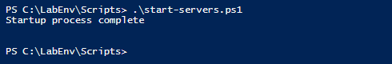
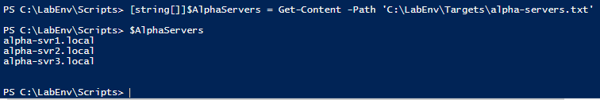
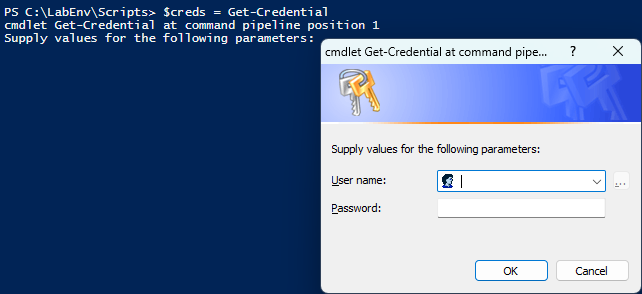
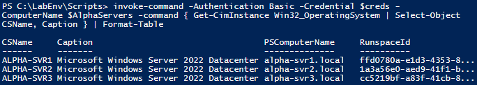
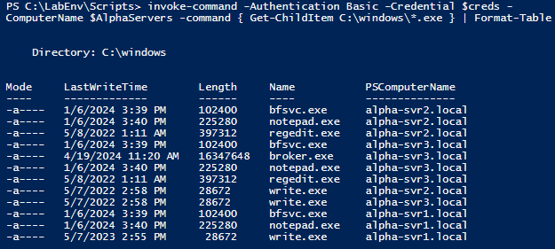
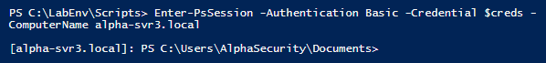

# 🛍️ Project Walkthrough

## *Threat Hunting at Scale with PowerShell Remoting*


## 🔹 **Step 1: Launch Remote Servers**

Run the pre-configured lab setup script to simulate three remote Windows Server containers.

```powershell
.\start-servers.ps1
```

>💡 *This script starts alpha-svr1, alpha-svr2, and alpha-svr3.*

---

## 🔹 **Step 2: Load Server List**

The lab provided a pre-configured file containing the names of the target systems. This list was stored in a specified directory within the lab environment.

```powershell
[string[]]$AlphaServers = Get-Content -Path 'C:\LabResources\server-list.txt'
```

 `$AlphaServers`: Loads hostnames of the remote systems into an array

>🗒️ Note: The path and file were pre-configured as part of the lab training environment.

---

## 🔹 **Step 3: Store Administrative Credentials**

```powershell
$creds = Get-Credential
```

 `$creds`: Prompts for secure admin credentials for remote access
  
>🔐 This step ensures credentials are handled securely through PowerShell's built-in credential object.*

---
## 🔹 **Step 4: Get OS Info Remotely**

```powershell
Invoke-Command -Authentication Basic -Credential $creds -ComputerName $AlphaServers -Command {
    Get-CimInstance Win32_OperatingSystem | Select-Object CSName, Caption
} | Format-Table
```

>🌟 *This verifies connectivity and gathers basic OS info.*

---

## 🔹 **Step 5: Search for Malicious Executables**

During the investigation, a suspicious file named `broker.exe` was found on only one system. Other systems contained a similar file named `proxy.exe`.

- `broker.exe` was located at:
  `C:\Windows\broker.exe` on `alpha-svr3.local`, discovered via scanning script executed from:
  ```
  PS C:\LabEnv\Scripts> 
  ```
  
- `proxy.exe` was located at:
  `C:\Windows\System32\proxy.exe`, observed during an interactive PowerShell Remoting session:
  ```
  [alpha-svr3.local]: PS C:\Users\Analyst\Documents>
  ```

```powershell
Invoke-Command -Authentication Basic -Credential $creds -ComputerName $AlphaServers -Command {
    Get-ChildItem C:\Windows\*.exe
} | Format-Table
```

---

## 🔹 **Step 6: Start an Interactive Remote Session on the Suspicious Server**

To investigate broker.exe more closely, we initiate a live session with the compromised host using Enter-PSSession.

```powershell
Enter-PSSession -Authentication Basic -Credential $creds -ComputerName alpha-svr3.local
```
This gives us direct, interactive access to alpha-svr3.local, indicated by a prompt like:
```powershell
[alpha-svr3.local]: PS C:\Users\Analyst\Documents>
```

>✔️ *This allows for deeper inspection of files and system configuration. Notice new command prompt.*

---

## 🔹 **Step 6: Compare File Hashes**

After identifying both files, their hashes were compared using `Get-FileHash` to determine if they were identical.

```powershell
Get-FileHash C:\Windows\broker.exe -Algorithm SHA256
Get-FileHash C:\Windows\System32\proxy.exe -Algorithm SHA256
```
✔️ *Result: The SHA256 hashes matched, confirming both files are identical despite being named and placed differently—a tactic often used by threat actors to evade detection.*

---

## 🔹 **Step 7: Check for Persistence – Admin Accounts**

```powershell
Invoke-Command -Authentication Basic -Credential $creds -ComputerName $AlphaServers -Command {
    Get-LocalGroupMember -Group "Administrators"
} | Format-Table
```

- Detected suspicious account: `Adninistrator` (misspelled)
- Present on both `alpha-svr3` and `alpha-svr1`

---

## 🔹 **Step 8: Check for Persistence – New Services**

```powershell
Invoke-Command -Authentication Basic -Credential $creds -ComputerName $AlphaServers -Command {
    Get-WinEvent -FilterHashtable @{LogName='System'; ID=7045} -MaxEvents 3
} | Format-List
```

- Event ID 7045 = *New service installed*
- Helps detect stealthy persistence methods used by APT groups

---

## 🏁 Final Findings

| IOC                       | Host(s) Affected       | Notes                                                                |
|---------------------------|------------------------|----------------------------------------------------------------------|
| `broker.exe`              | alpha-svr3             | Found only here at C:\Windows\broker.exe                             |
| `proxy.exe`               | alpha-svr1, alpha-svr2 | Same hash as `broker.exe`, located at C:\Windows\System32\proxy.exe  |
| `Adninistrator` account   | alpha-svr3, alpha-svr1 | Likely attacker backdoor                                             |
| New service events (7045) | All hosts              | Reviewed for persistence                                             |

---

## 🧠 Skills Demonstrated

- PowerShell scripting & automation
- PowerShell Remoting
- Threat hunting methodology
- IOC detection and hash analysis
- Persistence detection via account and service review
- Scalable incident response

Add full project walkthrough
